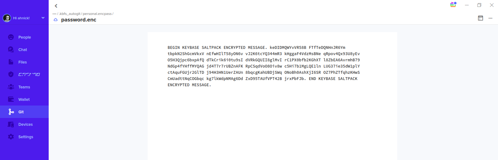

# encpass-keybase.sh - Keybase Extension

The keybase extension allows encpass.sh to use Keybase keys and encrypted git repos to store and access secrets.  This means the default OpenSSL encryption mechanism is replaced with the builtin encryption performed by the Keybase client.  When a secret is encrypted, it is encrypted with the Per-User Keys for either your Keybase user or the Keybase team your specify.  This means when someone is added to a team in Keybase they will immediately be able to clone and have access to the encpass.sh secrets in the Keybase git repo.  Also, Keybase will take care of rotating the keys for the team when a user is removed.

## Setup
To setup the Keybase extension, clone the encpass.sh GitHub repo and place the directory on your path OR place the encpass-keybase.sh script in a directory on your $PATH.  Once completed you should be able to run the following command to see that the extension is available:

```
$ encpass.sh extension list
The following extension are available:
keybase
```

To enable it simply type the following:
```
$ encpass.sh extension enable keybase
Extension keybase enabled.
```

## Getting Started
Using the encpass.sh Keybase extension is similar to using the default encpass.sh OpenSSL implementation, but you must first setup and clone the Keybase repos.  Here is an example to get your started.  We will be using my Keybase username, ahnick, and a repo called "personal" for the purposes of this example.

First, create a repo in Keybase.
```
$ encpass.sh create-repo ahnick personal
Creating personal repo for ahnick...
personal repo for ahnick created.
```

Next, list the repos to see your new repo you just created.
```
$ encpass.sh list-repos
OWNER                           REPO                     CLONE COMMAND           
+++++                           ++++                     +++++++++++++           
ahnick                          personal                 /usr/local/bin/encpass.sh clone-repo ahnick personal 
```

You should see your newly created repo.  Copy and paste the CLONE COMMAND provided above to clone the Keybase repo to your local filesystem.
```
$ /usr/local/bin/encpass.sh clone-repo ahnick personal
Cloning repo personal for ahnick...
Cloning complete.
encpass repo personal for ahnick is empty. Initializing...
personal repo for ahnick is initialized.
```

If you run a "show" command now, you will be able to see that a new bucket has been setup for the repo, but it doesn't contain any passwords yet.
```
$ encpass.sh show ahnick~personal
ahnick~personal:

```

Now add a secret to the new bucket.  You will be prompted to type and confirm your secret.
```
$ encpass.sh add ahnick~personal password
Adding secret "password" to bucket "ahnick~personal"...
Enter password:
Confirm password:
```

If we show the secrets of the bucket again we will see our newly added secret
```
$ encpass.sh show ahnick~personal 
ahnick~personal:
password = toomanysecrets
```

Our secret exists on the local filesystem, but needs to be pushed to the Keybase remote repo.  We can confirm this by running a "status" command.
```
$ encpass.sh status

         SECRETS THAT NEED TO BE COMMITTED          
+++++++++++++++++++++++++++++++++++++++++++++++++++++++++
?? password.enc
ahnick~personal
+++++++++++++++++++++++++++++++++++++++++++++++++++++++++

```

The output from the "status" command lists the name of the secret that was added and the bucket it belongs too.  Finally we just need to "store" the secrets for the bucket.
```
$ encpass.sh store ahnick~personal 
Committing and pushing secret changes for bucket ahnick~personal to remote repo keybase://private/ahnick/personal.encpass...
ahnick~personal secret changes committed.
Syncing encrypted data to Keybase: done.
```

If you were to view the secret in the Keybase client you would see the following SALTPACK encrypted message.


## Bucket creation
Remember, the first time you are creating a bucket to hold secrets you will need to do the following:
1. Create the remote Keybase repo.
2. Clone the remote Keybase repo to your local filesystem.
3. Add a secret to the bucket that was created during the clone step.

## Additional Commands
The Keybase extension provides the following additional commands:
* create-repo (Creates a remote Keybase git repo)
* delete-repo (Deletes a remote Keybase git repo)
* clone-repo (Clones the remote Keybase git repo to your local filesystem)
* list-repos (Lists all the encpass.sh remote Keybase git repos)
* refresh (Runs a "git pull --rebase" to refresh all secrets from the remote Keybase git repos)
* status (Lists all local filesystem changes to secrets that need to be committed and pushed to the remote Keybase git repos)
* store (Commits and pushs secrets for an encpass.sh bucket to its corresponding remote Keybase git repo)

## Modifications to existing commands
The following commands are disabled for the Keybase extension:
* lock (The Keybase client software is responsible for automatically locking when you sign out)
* unlock (The Keybase client software is responsible for automatically unlocking when you sign in)
* rekey (The Keybase client software takes care rotating keys when necessary)

You may NOT create a bucket directly using the "add" command without cloning.  This is done to ensure that the local filesystem bucket is properly setup and tracking to the remote Keybase git repo.

## Questions
If you have more questions, see the help documentation by running the usual help command
```
encpass.sh ?
```
